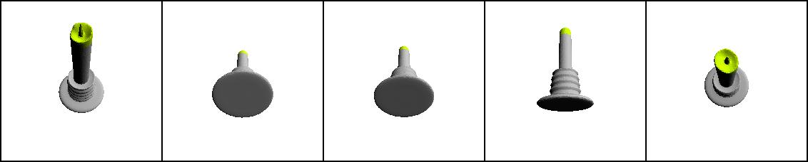
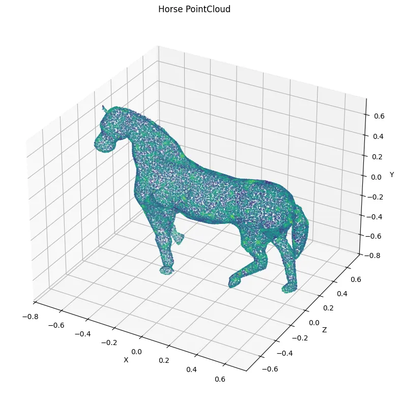
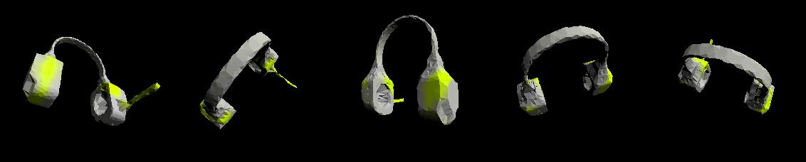

# Neural Highlighting of Affordance Regions

## Overview

This project focuses on building a label-free pipeline for affordance generation using pre-trained vision-language models. The goal is to identify affordance regions—parts of an object that are most useful for achieving specific tasks, based on natural language descriptions. The pipeline is tested on 3D meshes and point cloud data, leveraging the **CLIP** (Contrastive Language-Image Pretraining) model and differentiable rendering techniques.

The project is divided into three main parts:
1. Implementing the neural highlighter model for 3D meshes using CLIP and differentiable rendering.
2. Adapting the pipeline to handle point cloud data.
3. Evaluating the model's performance on the **AffordanceNet benchmark**.

## Key Features

- **Label-Free Affordance Generation**: The pipeline generates affordance regions without requiring explicit supervision or labeled datasets.
- **CLIP Integration**: The model uses CLIP to align visual data of 3D shapes with natural language descriptions, enabling affordance detection based on textual prompts.
- **Differentiable Rendering**: The pipeline employs differentiable rendering to project 3D data into 2D images, allowing the use of pre-trained vision-language models.
- **Point Cloud Adaptation**: The pipeline is adapted to work with point cloud data, which is commonly used in 3D sensing, by converting point clouds into meshes using **Poisson Surface Reconstruction**.
- **AffordanceNet Benchmarking**: The model is evaluated on the AffordanceNet benchmark, which provides ground truth labels for object affordances related to human-object interactions.

## Methodology

### Neural Highlighter Model
The neural highlighter model consists of a multi-layer perceptron (MLP) that predicts the probability of a vertex being part of an affordance region. The model is trained using a contrastive loss function that measures the cosine similarity between image embeddings (from rendered 3D meshes) and text embeddings (from textual prompts).

### Point Cloud Adaptation
To handle point cloud data, the pipeline converts point clouds into 3D meshes using **Poisson Surface Reconstruction**. This method ensures smooth and continuous surfaces, even with noisy or incomplete point cloud data.

### AffordanceNet Benchmarking
The pipeline is tested on the AffordanceNet benchmark, which provides a rich collection of 3D objects annotated with affordance labels. The model's performance is evaluated using the **mean Intersection over Union (mIoU)** metric, which compares predicted affordance regions with ground truth labels.

## Experiments and Results

### Hyperparameter Tuning
The project explored various hyperparameters, including learning rate, network depth, and the number of sampled views. The best results were achieved with a learning rate of \(1 \times 10^{-4}\), a network depth of 4 layers, and 5 sampled views per object.

### Training Augmentation
Training augmentations, such as random rotations, flips, and color modifications, were applied to improve the model's robustness and generalization. These augmentations helped the model handle variations in object appearance and orientation, leading to better performance on real-world data.

### Surface Reconstruction
The **Poisson Surface Reconstruction** method was used to convert point clouds into meshes. The depth parameter was adjusted to control the level of detail in the reconstruction, with higher depths producing more detailed meshes at the cost of increased computational requirements.

### AffordanceNet Benchmark
The model was evaluated on the AffordanceNet benchmark, focusing on common household items like knives, scissors, and earphones. The results showed that the pipeline could effectively predict affordance regions, but further refinements are needed to improve accuracy and computational efficiency.

## Conclusion

The project successfully implemented a label-free pipeline for affordance generation using pre-trained vision-language models. Key improvements were achieved through data augmentation and refining the mesh reconstruction process. However, challenges remain in capturing finer details and improving the accuracy of predicted affordance regions. Future work could focus on optimizing mesh reconstruction techniques and enhancing the augmentation pipeline to improve model robustness and generalization.

## References

1. D. Decatur, I. Lang, and R. Hanocka, "3D Highlighter: Localizing Regions on 3D Shapes via Text Descriptions," 2023 IEEE/CVF Conference on Computer Vision and Pattern Recognition (CVPR), 2023.
2. S. Deng, X. Xu, C. Wu, K. Chen, and K. Jia, "3D AffordanceNet: A Benchmark for Visual Object Affordance Understanding," 2021 IEEE/CVF Conference on Computer Vision and Pattern Recognition (CVPR), 2021.
3. A. Radford et al., "Learning Transferable Visual Models From Natural Language Supervision," 2021 IEEE/CVF Conference on Computer Vision and Pattern Recognition (CVPR), 2021.
4. R. Zhang et al., "PointCLIP: Point Cloud Understanding by CLIP," 2022 IEEE/CVF Conference on Computer Vision and Pattern Recognition (CVPR), 2021.
